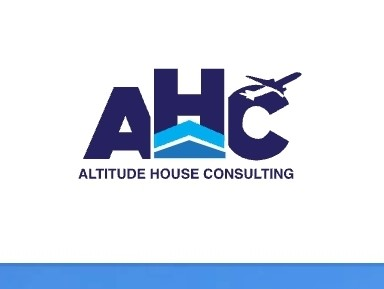

# ✈️ ERP Data Training Series  
## Powered by Altitude House Consulting

Welcome to your ERP learning hub. This free training series includes SQL scripts, Power BI templates, and ERP star schema models using real-world systems like **SAP, PeopleSoft, Infor, Deltek, and Sage**.

---

## 📥 Download Training Files

<strong>📦 Week 1 – Installing SQL Server Express & Power BI</strong>

- 📄 [Slides (PDF)](Week1/Slides.pdf)
- 💾 [SQL Scripts (ZIP)](Week1/SQL_Scripts.zip)

<strong>📊 Week 2 – ERP Base Tables & Star Schemas</strong>

- 🧾 [Power BI Template (PBIX)](Week2/PowerBI_Template.pbix)

<strong>🛠️ Week 3 – Data Cleansing and ETL</strong>

- *(Files coming soon)*

<strong>📈 Week 4 – Power BI Dashboard Customization</strong>

- *(Files coming soon)*

---

## 🎬 Watch the Series on YouTube  
👉 [Altitude House YouTube Channel](https://www.youtube.com/@altitudehouseconsulting)

---

© Altitude House Consulting – Simplifying enterprise analytics.